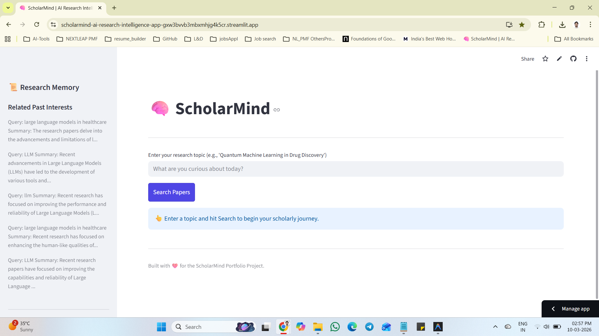
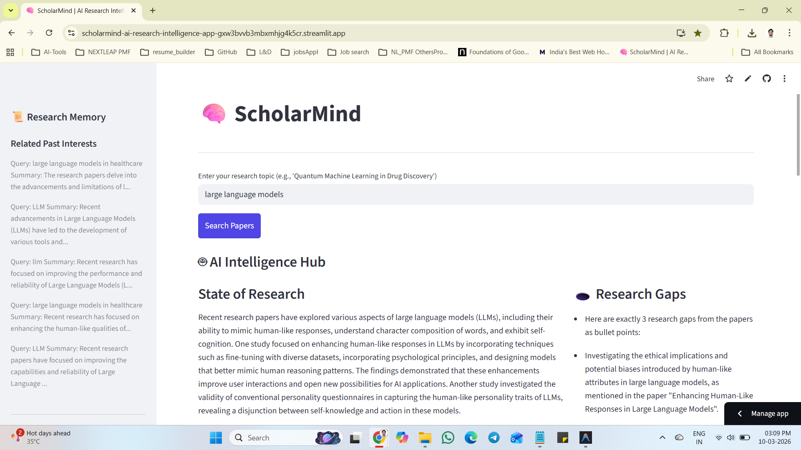
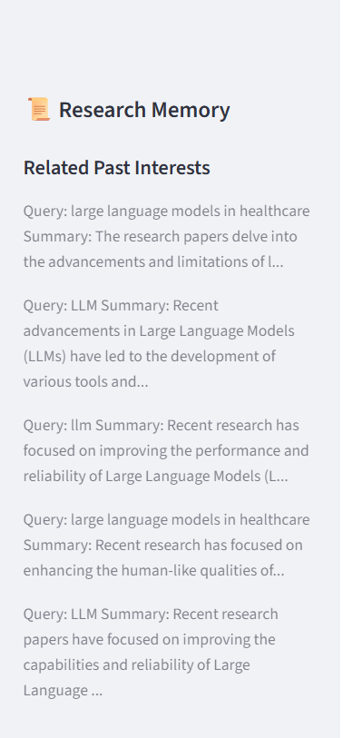
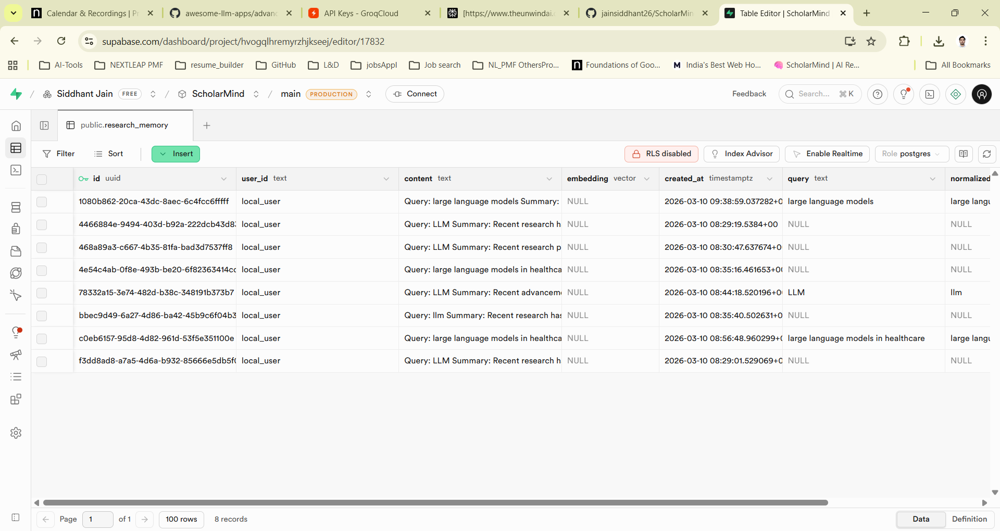

# 🧠 ScholarMind — AI Research Intelligence Hub

> An AI research assistant that searches academic papers, summarizes findings, detects research gaps, and remembers your interests.

[](https://scholarmind-ai-research-intelligence-app-gxw3bvvb3mbxmhjg4k5cr.streamlit.app/)
[](https://github.com/jainsiddhant26/ScholarMind-AI-Research-Intelligence-Hub)

**🔗 Live App**: https://scholarmind-ai-research-intelligence-app-gxw3bvvb3mbxmhjg4k5cr.streamlit.app/

---

## Screenshots

### 🏠 Home Screen


### 🤖 AI Intelligence Hub — After Search


### 🧠 Research Memory Sidebar


### 🗄️ Supabase Memory Table


---

## What the app does

- 🔍 Search papers from **arXiv** and **Semantic Scholar**
- 🤖 Summarize research with **Groq Llama 3.3**
- 🕳️ Generate **3 research gaps** from paper abstracts
- 🧠 Save and recall user search memory via **Supabase**
- 📊 Visualize publication trends by year
- 📥 Export results as **CSV** and **BibTeX**

---

## Why this project is portfolio-worthy

ScholarMind is not just an AI demo. It shows:
- Clear problem framing and MVP scoping
- Practical tradeoff decisions under free-tier constraints
- Multi-API orchestration (arXiv, Semantic Scholar, Groq, Supabase)
- Real debugging and iteration — memory dedup, retry logic, Streamlit state management
- End-to-end shipping: local build → GitHub → public deployment

---

## Product goal

Reduce the friction of early-stage literature review by combining discovery, summarization, memory, and export into one workflow.

---

## Target users

- Students doing literature reviews
- Researchers scanning new areas
- PMs tracking technical trends
- Analysts learning fast-moving AI topics

---

## Core problem

Academic discovery is:
- repetitive — users search the same topics again and again
- hard to synthesize — no easy summary across multiple papers
- easy to forget — no memory of what was explored before
- fragmented — search, notes, and export are all separate tools

---

## Solution

ScholarMind combines:
- **Search** → fetch papers from multiple academic sources
- **Reasoning** → summarize findings and detect open questions
- **Memory** → save and recall prior search interests
- **Visualization** → show publication trends
- **Export** → let users take results into their own workflow

---

## Tech stack

| Layer | Tool | Role |
|-------|------|------|
| Frontend | Streamlit | Web app UI and orchestration |
| Search source 1 | arXiv REST API | Paper retrieval via direct HTTP calls |
| Search source 2 | Semantic Scholar REST API | Paper retrieval (unauthenticated, with retry) |
| Summarization | Groq (llama-3.3-70b-versatile) | Summary and research-gap generation |
| Memory DB | Supabase Postgres | Persistent memory store |
| Vector extension | pgvector | Prepared for future semantic memory |
| Data handling | pandas | Result normalization and deduplication |
| Charting | Plotly Express | Publication trend visualization |
| Config | python-dotenv | Environment variable management |
| Deployment | Streamlit Community Cloud | Free public hosting via GitHub |

---

## Architecture

```
User
  │
  ▼
Streamlit App (app.py)
  │
  ├── agents/search.py
  │     ├── arXiv REST API (XML parsing, direct HTTP)
  │     └── Semantic Scholar API (retry + exponential backoff on 429)
  │
  ├── agents/summarize.py
  │     └── Groq Llama 3.3 (summary + research gaps)
  │
  ├── agents/memory.py
  │     └── Supabase Postgres
  │           └── research_memory table (upsert + normalized dedup)
  │
  └── utils/export.py
        ├── CSV download
        └── BibTeX download
```

### How it works

1. User enters a topic in the Streamlit UI
2. App calls arXiv REST API and Semantic Scholar
3. Results are normalized into a shared schema
4. Duplicate papers are removed by title
5. Groq LLM generates a multi-paper summary
6. Groq LLM generates 3 research gaps
7. Query and summary are saved to Supabase memory
8. Past interests appear in the sidebar automatically
9. Users export results as CSV or BibTeX

---

## Project structure

```
scholarmind/
├── app.py
├── requirements.txt
├── .env.example
├── README.md
├── screenshots/
│   ├── home.png
│   ├── results.png
│   ├── memory.png
│   └── supabase.png
├── agents/
│   ├── search.py
│   ├── memory.py
│   └── summarize.py
└── utils/
    └── export.py
```

---

## What we built step by step

### Step 1 — Project scaffold

Created a multi-file Streamlit app with separate agents for search, summarization, memory, and a utils layer for export.

### Step 2 — Paper search

Added arXiv and Semantic Scholar as sources. Normalized both into a shared schema with `title`, `authors`, `abstract`, `year`, `url`, `source`. Merged and deduplicated by lowercase title.

### Step 3 — LLM summarization and research gaps

Added Groq Llama 3.3 to generate a plain-language research summary and 3 research gaps per search.

### Step 4 — Memory with Supabase

Added persistent memory using Supabase Postgres. Saves the user query, a normalized query, and a summary snippet. Shows prior interests in the sidebar.

### Step 5 — Fix memory display bugs

Early memory rows were dicts but the UI sliced them like strings. Fixed by reading the `content` field safely with `.get("content", "")`.

### Step 6 — Fix import and module issues

Resolved import errors in `summarize.py` by rewriting the file cleanly, clearing `__pycache__`, and validating imports before restarting Streamlit.

### Step 7 — Fix Streamlit rerun behavior

Replaced `st.rerun()` after memory saves with `st.session_state`. This kept results visible, avoided duplicate inserts, and saved memory only once per unique query.

### Step 8 — Smarter memory dedup

Added `query` and `normalized_query` columns to the Supabase table. Created a unique index on `(user_id, normalized_query)`. Used `upsert` so `LLM`, `llm`, and `  LLM  ` map to the same memory record.

### Step 9 — Improve Semantic Scholar reliability

Without an API key, Semantic Scholar rate-limits aggressively. Updated search logic to:
- keep result limit low (2 papers)
- request only required fields
- wait 2.5s between requests
- retry on `429` with exponential backoff
- fail gracefully instead of breaking the app

### Step 10 — Fix arXiv for cloud deployment

The arXiv Python client failed on Streamlit Cloud. Replaced it with direct arXiv REST API calls using `requests` and XML parsing, which works reliably in cloud environments.

### Step 11 — Charts and exports

Added publication trend chart by year using Plotly, CSV export, and BibTeX export.

### Step 12 — Deploy to Streamlit Community Cloud

Pushed to GitHub, connected repo to Streamlit Community Cloud, added secrets, deployed.

Fixed a `pyarrow==14.0.2` build error by unpinning to `pyarrow>=15.0.0` for Python 3.14 compatibility.

---

## Local setup

### 1) Clone the repo

```bash
git clone https://github.com/jainsiddhant26/ScholarMind-AI-Research-Intelligence-Hub.git
cd ScholarMind-AI-Research-Intelligence-Hub
```

### 2) Create a virtual environment

**Windows**
```bash
python -m venv venv
venv\Scripts\activate
```

**macOS / Linux**
```bash
python3 -m venv venv
source venv/bin/activate
```

### 3) Install dependencies

```bash
pip install -r requirements.txt
```

### 4) Create your .env file

```bash
cp .env.example .env
```

Then fill in your real keys inside `.env`.

---

## Environment variables

```env
GROQ_API_KEY=your_groq_api_key
GEMINI_API_KEY=optional
SUPABASE_URL=your_supabase_project_url
SUPABASE_KEY=your_supabase_service_role_key
```

- `GROQ_API_KEY` → required for summaries and research gaps
- `SUPABASE_URL` and `SUPABASE_KEY` → required for memory
- Semantic Scholar works without an API key (rate limits apply)

---

## Supabase setup

Run this SQL once in the Supabase SQL Editor:

```sql
create table public.research_memory (
  id uuid not null default gen_random_uuid (),
  user_id text not null,
  content text null,
  embedding extensions.vector null,
  created_at timestamp with time zone null default now(),
  query text null,
  normalized_query text null,
  constraint research_memory_pkey primary key (id)
) TABLESPACE pg_default;

create index IF not exists research_memory_embedding_idx
on public.research_memory
using ivfflat (embedding extensions.vector_cosine_ops)
with (lists = '100') TABLESPACE pg_default;

create unique index IF not exists research_memory_user_query_uidx
on public.research_memory
using btree (user_id, normalized_query) TABLESPACE pg_default;
```

---

## Run locally

```bash
streamlit run app.py
```

---

## Troubleshooting

### Semantic Scholar rate limit

```
Semantic Scholar rate limit hit. Retrying in 3.2s...
```

Expected on the free path. Wait a few seconds and retry. The app continues using arXiv results in the meantime.

### Memory not saving

- Check `.env` has valid Supabase credentials
- Check `research_memory` table exists in Supabase
- Confirm `SUPABASE_KEY` is a service role key

### Results disappear after search

Current implementation uses `st.session_state` to keep results stable. Make sure you are using the latest `app.py` from this repo.

### Duplicate memories

- Confirm `normalized_query` column exists
- Confirm unique index was created
- Confirm `memory.py` uses `upsert` with `on_conflict="user_id,normalized_query"`

---

## Limitations

- Semantic Scholar free usage can be rate-limited
- No user authentication yet
- Memory stores text only — not yet using vector embeddings for recall
- Sidebar shows recent interests, not relevance-ranked memory
- Research gap quality depends on model output and paper quality

---

## Roadmap

- User authentication via Supabase Auth
- Saved-paper collections per user
- Semantic memory recall using embeddings
- Relevance-ranked memory instead of recency
- PDF upload and summarization
- Follow-up chat on top of search results
- Daily digest or topic alert feature

---

## Deployment

Deployed on **Streamlit Community Cloud**.

**Live URL**: https://scholarmind-ai-research-intelligence-app-gxw3bvvb3mbxmhjg4k5cr.streamlit.app/

### Secrets required in Streamlit Cloud

```toml
GROQ_API_KEY = "your_groq_key"
SUPABASE_URL = "your_supabase_url"
SUPABASE_KEY = "your_supabase_key"
GEMINI_API_KEY = "optional"
```

---

## Author

Built by **Siddhant Jain** as a portfolio project to demonstrate AI product development, research tooling, and practical full-stack iteration.

---

## License

MIT License
